# Docker workshop


## Install
[Tutorial link](https://docs.docker.com/engine/install/)  

```shell
sudo apt-get update
sudo apt-get install \
    ca-certificates \
    curl \
    gnupg \
    lsb-release

sudo mkdir -p /etc/apt/keyrings
curl -fsSL https://download.docker.com/linux/ubuntu/gpg | sudo gpg --dearmor -o /etc/apt/keyrings/docker.gpg
echo \
  "deb [arch=$(dpkg --print-architecture) signed-by=/etc/apt/keyrings/docker.gpg] https://download.docker.com/linux/ubuntu \
  $(lsb_release -cs) stable" | sudo tee /etc/apt/sources.list.d/docker.list > /dev/null

sudo apt-get update
sudo apt-get install docker-ce docker-ce-cli containerd.io docker-compose-plugin

sudo groupadd docker
sudo usermod -aG docker $USER
newgrp docker
docker run hello-world
```
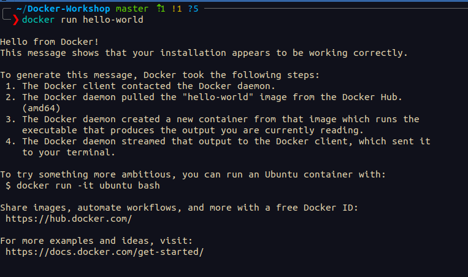  

## Mirror Registry
[Tutorial link](https://docker.ir/)  
A Docker registry is a system for versioning, storing and distributing Docker images. DockerHub is a hosted registry used by default when installing the Docker engine, but there are other hosted registries available for public use such as AWS and Google's own registries.

Add this to `/etc/docker/daemon.json`

```json
{
    "registry-mirrors": ["https://registry.docker.ir"]
}
```

and then restart docker
```shell
systemctl daemon-reload
systemctl restart docker
```


## First Image

```shell
docker pull redis
docker images
docker run --name rds -p 9000:6379 redis
docker ps
sudo apt install redis-tools
redis-cli -p 9000
```
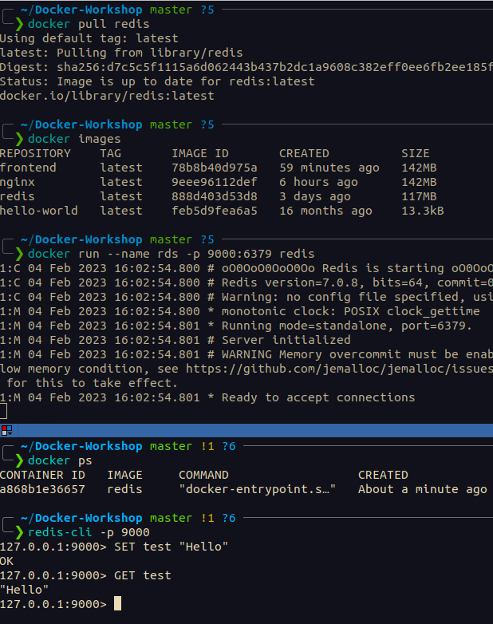  


`-a` is for attach
```shell
docker stop rds
docker start -a rds
docker rm `docker ps -a -q`
docker run --name rds -p 9000:6379 -d redis
docker exec -it rds bash
docker exec rds redis-cli GET test
```
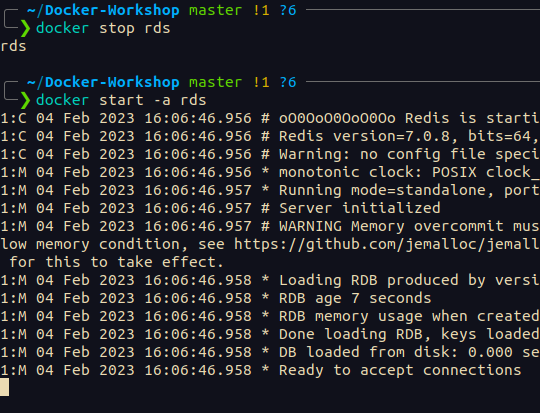  
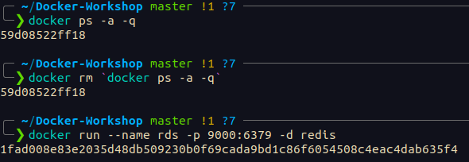  
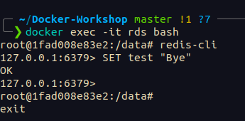  
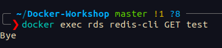  

## Serving site with nginx
### Dockerfile
```dockerfile
FROM nginx
COPY frontend/default.conf /etc/nginx/conf.d/default.conf
COPY frontend/*.html /usr/share/nginx/html/
COPY frontend/*.css /usr/share/nginx/html/
COPY frontend/*.ttf /usr/share/nginx/html/
COPY frontend/*.js /usr/share/nginx/html/
COPY frontend/img/* /usr/share/nginx/html/img/
```

### Config file
```
server {
    listen 80;

    location /{
        charset utf-8;
        root /usr/share/nginx/html;
    }
}
```

```shell
docker build -t frontend -f frontend/Dockerfile .
docker run --name nginx -p 9050:80 frontend
# Go to http://localhost:9050/
# Another way:
docker run -v  $(pwd)/frontend:/usr/share/nginx/html -v $(pwd)/frontend/default.conf:/etc/nginx/conf.d/default.conf -p 9050:80 nginx
``` 
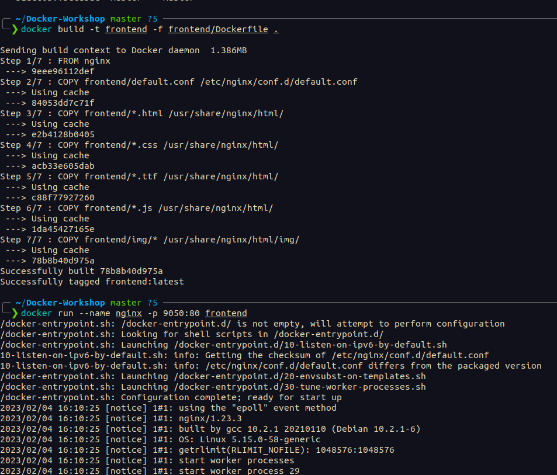  
  


## Networking
```shell
docker network ls
docker run --name redis-host --net=host redis
docker network inspect host
```
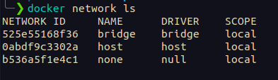  
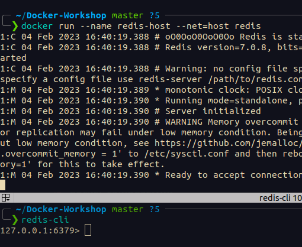  

```shell
docker run --name redis-1 redis
docker run --name redis-2 redis
docker network inspect bridge
```
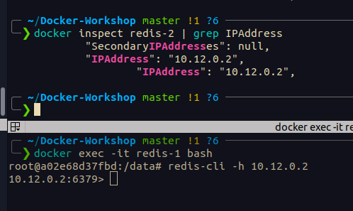  

```shell
docker network create --driver bridge redis-net
docker network connect --alias r1 redis-net redis-1
docker network connect --alias r2 redis-net redis-2
docker network inspect redis-net
docker exec redis-1 redis-cli -h r2 SET test "HELLO"
```
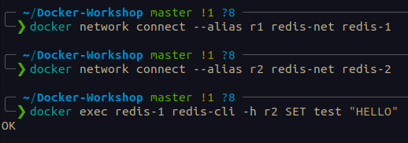  


## Backend


### Redis
```shell
docker run --name redis-back -d redis 
docker network create --driver bridge my-net
docker network connect --alias redis-server my-net redis-back
```

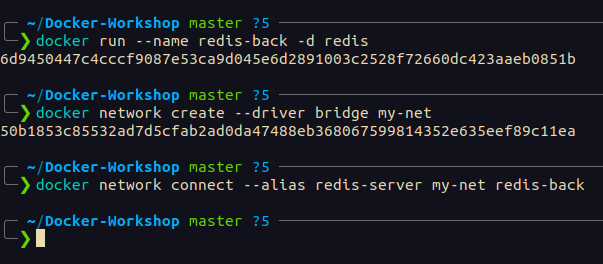  
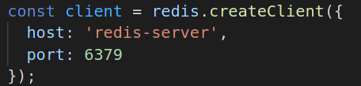  

### Backend

Nodejs server is running on port 5000

```dockerfile
FROM node:alpine
WORKDIR /usr/src/app
RUN pwd
COPY package*.json ./
RUN npm install
COPY . .
CMD ["node", "api.js"]
```

```shell
docker build -t backend -f nodejs/Dockerfile nodejs
docker run --name node-back -d backend
docker logs node-back
docker logs --tail=10 node-back
docker network connect --alias back my-net node-back
docker start node-back
docker logs -f --tail=1 node-back # or use docker start -a node-back
```
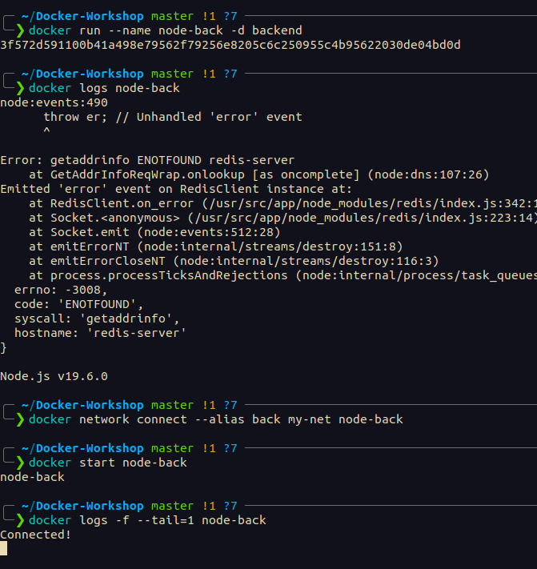  

### Frontend

```shell
docker start nginx
docker network connect my-net nginx
```

### Reverse Proxy
```
location /node/ {
    add_header Access-Control-Allow-Origin $http_origin;
    proxy_pass http://back:5000;
}
```

### Sencond Backend
```
docker build -t gobackend -f go/Dockerfile go
docker run --name goback --net=my-net gobackend
docker network connect --alias goback my-net goback
docker start -a goback
```


## Volume

[More on environment variables 1](https://medium.com/chingu/an-introduction-to-environment-variables-and-how-to-use-them-f602f66d15fa)  
[More on environment variables 2](https://docs.docker.com/compose/environment-variables/set-environment-variables/)  

```shell
docker volume create pgdata
docker volume list | grep "pgdata"
docker run -v pgdata:/var/lib/postgresql/data -e  POSTGRES_PASSWORD=mysecretpassword postgres
```

## Docker Compose

```shell
docker-compose up
docker-compose up -d
docker-compose logs --tail=100
docker-compose logs --tail=100 -f
```